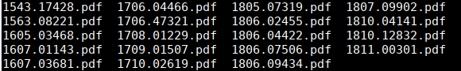
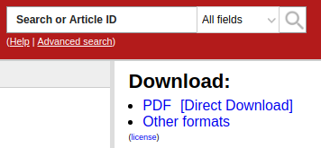

# arXivDDL
arXiv is a great resource but downloading article directly from the website inevitably result in this:

I got tired of it and I quickly hacked a TamperMonkey script to inject a new download button on arXiv. I am simply using the `download` html attribute to propose a sensible name for the PDF file (the article title)

I thought others might find it usefull so I bundled it in this small chrome extension.

Feel free enhance this as you wish !

