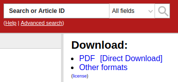

# arXivDDL
Chrome extension that allow for sensible name pdf when downloading from `arXiv.org`.

## Problem
arXiv is a great resource but downloading article directly from the website inevitably result in this:


## Solution
I got tired of it and I quickly hacked a TamperMonkey script to inject a new download button on arXiv. I am simply using the `download` html attribute to propose a sensible name for the PDF file (the article title)



I thought others might find it usefull so I bundled it in this small chrome extension.

Feel free enhance this as you wish ! Pull requests are welcome

## Installation
This extension is not distributed on the chromestore for now.
To install it, you must first clone this repo:
```
git clone https://github.com/j3rome/arXivDDL
```

Then you must enable the `Developer mode` in `chrome://extensions/`.

You will then be able to use the `Load unpacked` and select the cloned repo.
And it's now ready to go ! 

A `[Direct Download]` button will automatically appear when browsing `arXiv.org`.

If you're having trouble installing the extension, you can have a look at [this article](https://dev.to/ben/how-to-install-chrome-extensions-manually-from-github-1612).

## How it works
The whole code is about 20 lines so here it is : 
```javascript
(function() {
    'use strict';

    // Create a new link beside the original download link
    // Append the "Download" html attribute to the link with full article name
    var downloadLinkList = document.querySelector("div#abs div.extra-services ul li:first-child");
    var browserLink = downloadLinkList.children[0];
    var filename = document.title.replace("] ","]").replace(/ /g,"_") + ".pdf";

    var directLink = browserLink.cloneNode();
    directLink.innerText = "[Direct Download]";
    directLink.setAttribute("download",filename);
    directLink.setAttribute("style","margin-left:10px");

    downloadLinkList.append(directLink);

})();
```

The title is retrieved from the `document.title` attribute. The download link is duplicated and the `download` attribute is used to set the filename to the title of the article. That's it


## Permissions
The extension will be activated on pages with the following url pattern :
```
https://arxiv.org/abs/*
```

